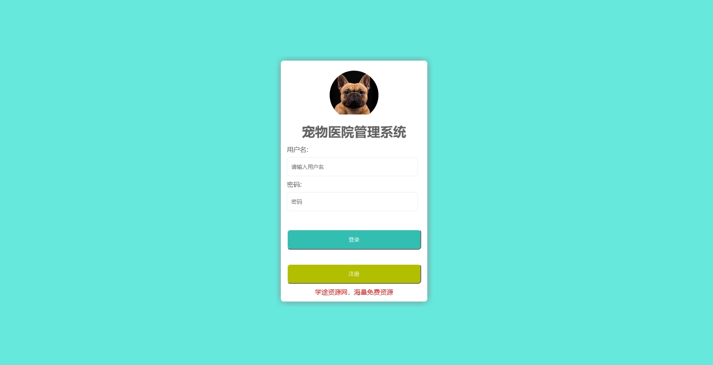
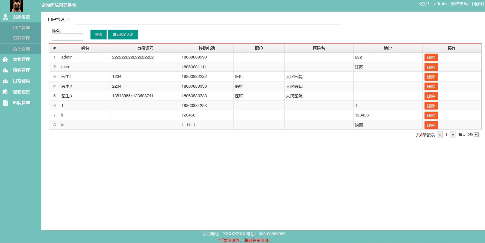
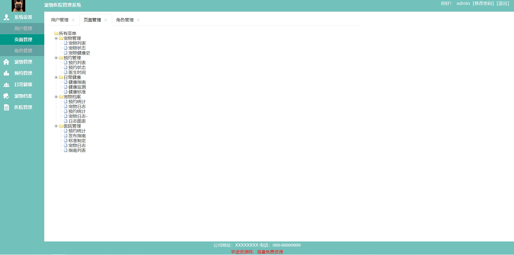
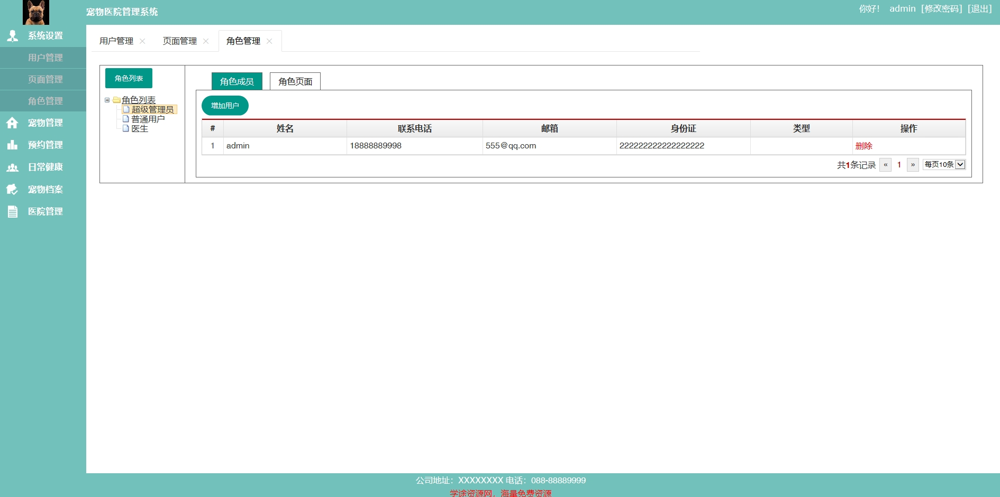
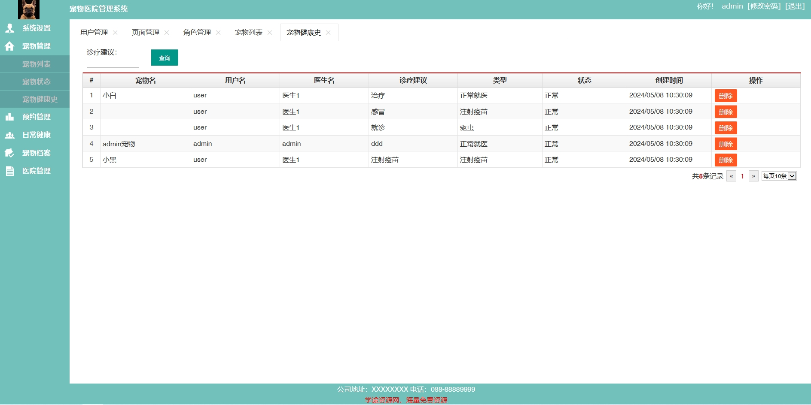
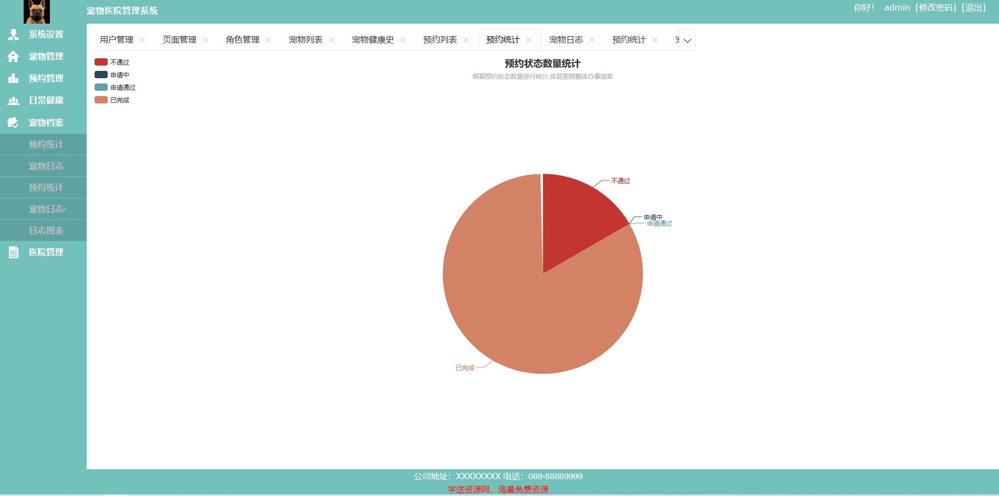
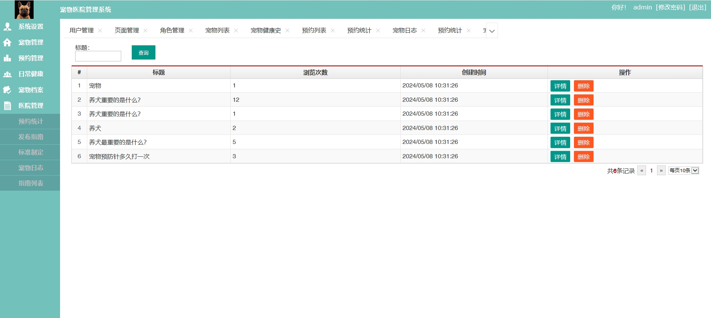
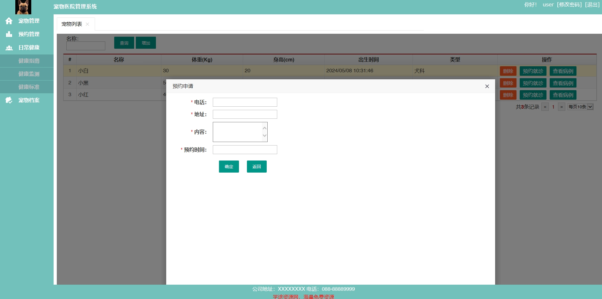
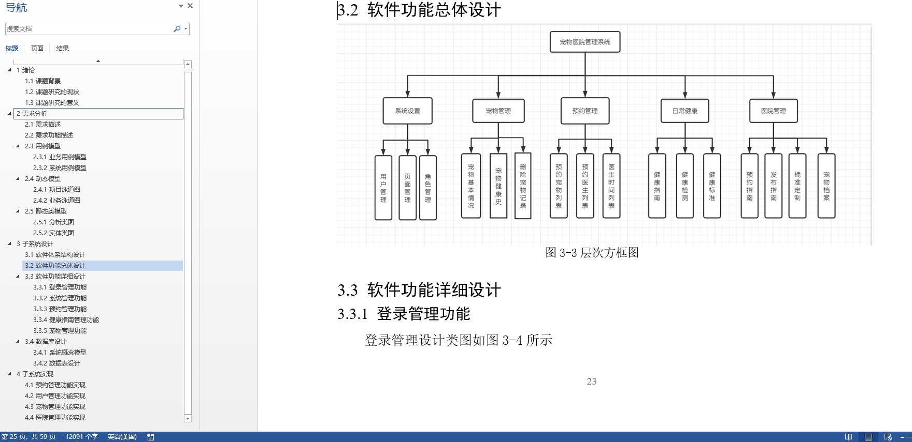

1.项目介绍
系统角色：管理员、宠物医师、普通用户
功能模块：用户管理、页面管理、角色管理、宠物管理、预约管理、日常健康、宠物档案、医院管理等
技术选型：SpringBoot，thymeleaf等
测试环境：idea2024，jdk1.8，mysql5.7，maven3
2.项目部署
创建数据库，导入sql文件
idea打开目录phmsn，根据本地数据库环境修改 src/main/resources/application.properties  6-9行
启动项目：src/main/java/com/phms/PhmsApp.jav
后端管理web：http://localhost:8080/index  管理员账号密码：admin/123456
3.项目部分截图

# 4.获取方式
[戳我查看](https://gitee.com/aven999/mall)
